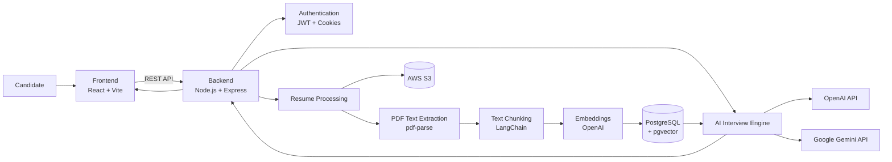

# Intervia

**AI-powered interview platform that helps candidates prepare for technical interviews through personalized, resume-aware AI interviews and intelligent feedback.**

Intervia is a full-stack AI interview platform designed to simulate technical interview experiences. Candidates create an account, upload their resume, and interact with an AI-powered interview system built around their actual background and skills — rather than a generic question bank.

**🔗 Live demo:** [intervia-lac.vercel.app](https://intervia-lac.vercel.app/signup)

---

## What it does

1. **Authentication** — create an account and securely sign in.
2. **Resume upload** — upload a PDF resume for analysis.
3. **Resume processing** — extract text from the uploaded resume and process it for AI-powered retrieval.
4. **Personalized interviewing** — generate interview interactions based on the candidate's background and technical skills.
5. **AI-powered responses** — use large language models to generate interview questions and responses.
6. **Knowledge retrieval** — use embeddings and vector-based retrieval to ground responses in the candidate's actual resume content.
7. **Interview experience** — interact with the platform through a modern React-based interface.

---

## Why Intervia?

Traditional interview preparation often relies on generic question lists that don't take the candidate's actual experience into account.

Intervia is built around a different premise: instead of asking —

> "Give me some JavaScript interview questions."

— it grounds interview questions and interactions in the candidate's actual experience, projects, skills, and resume content.

---

## Architecture



---

## Core workflow

### 1. User authentication

Users create an account and sign in through the frontend. The backend handles:

- User registration
- User login
- JWT-based authentication
- Refresh-token authentication
- HTTP cookies
- Password hashing with bcrypt
- Protected API routes

### 2. Resume upload

```
PDF Resume
    ↓
Multer
    ↓
PDF Text Extraction
    ↓
Extracted Resume Text
```

The original resume file is stored in AWS S3, while the extracted text is processed for downstream AI functionality.

### 3. Resume processing

The extracted resume content is split into smaller pieces using LangChain text splitters:

```
Resume
    ↓
Text Extraction
    ↓
Text Chunking
    ↓
Embeddings
    ↓
Vector Storage
```

This allows relevant parts of the resume to be retrieved when generating AI responses.

### 4. Retrieval-augmented generation

```
User Question
    ↓
Create Embedding
    ↓
Vector Search
    ↓
Retrieve Relevant Resume Context
    ↓
AI Model
    ↓
Generated Response
```

The backend uses PostgreSQL together with pgvector for vector-based retrieval.

---

## AI stack

- **OpenAI** — LLM and embedding functionality
- **Google Gemini** — generative AI capabilities
- **LangChain** — text splitting and retrieval-related workflows
- **pgvector** — vector similarity search
- **PostgreSQL** — primary relational database

---

## Tech stack

**Frontend:** React 19, TypeScript, Vite, Tailwind CSS, React Router, React Hook Form, Zod, Axios, shadcn/ui, Lucide React
**Backend:** Node.js, TypeScript, Express 5, JWT, bcrypt, Multer, Zod, PDF parsing
**AI / RAG:** OpenAI API, Google Gemini API, LangChain, OpenAI embeddings, pgvector
**Database & storage:** PostgreSQL, Prisma ORM, pgvector, AWS S3
**Development:** Vite, TypeScript, ESLint, tsx, npm

---

## Project structure

```
.
├── .github/
│   └── workflows/
│
├── backend/
│   ├── src/
│   ├── prisma/
│   ├── package.json
│   └── ...
│
├── frontend/
│   ├── src/
│   ├── public/
│   ├── package.json
│   └── ...
│
├── .gitignore
└── README.md
```

**Backend** — authentication, resume upload, resume processing, AI integration, database operations, vector retrieval, API endpoints.

**Frontend** — authentication screens, dashboard, resume functionality, interview experience, AI interactions, navigation and UI components.

---

## Getting started

### Prerequisites

- Node.js
- npm
- PostgreSQL
- Git
- API credentials for the external services used by the application (OpenAI, Gemini, AWS)

### Clone the repository

```bash
git clone <your-repository-url>
cd intervia
```

### Backend setup

```bash
cd backend
npm install
```

Create a `.env` file in `backend/`:

```bash
DATABASE_URL=your_postgresql_connection_string

JWT_ACCESS_SECRET=your_access_secret
JWT_REFRESH_SECRET=your_refresh_secret

AWS_REGION=your_aws_region
AWS_ACCESS_KEY_ID=your_aws_access_key
AWS_SECRET_ACCESS_KEY=your_aws_secret
AWS_S3_BUCKET=your_bucket_name

OPENAI_API_KEY=your_openai_api_key
GEMINI_API_KEY=your_gemini_api_key
```

Run migrations and generate the Prisma client:

```bash
npx prisma migrate dev
npx prisma generate
```

Start the backend:

```bash
npm run dev        # development
npm run build       # production build
npm start           # production server
```

### Frontend setup

In a separate terminal:

```bash
cd frontend
npm install
npm run dev          # development
npm run build         # production build
npm run preview       # preview production build
```

Add the required frontend environment variables (e.g. the backend API base URL) before running.

---

## Environment variables

The application uses environment variables for sensitive credentials and external services, covering:

- PostgreSQL
- JWT authentication
- AWS S3
- OpenAI
- Google Gemini
- Frontend API configuration

**Never commit `.env` files or API keys to GitHub.**

---

## Security

- Password hashing with bcrypt
- JWT authentication
- Refresh-token based sessions
- HTTP cookies
- Environment variables for secrets
- Request validation with Zod
- CORS configuration
- Protected backend routes

---

## Example AI workflow

```
Candidate
    ↓
Upload Resume
    ↓
Resume stored in S3
    ↓
Extract PDF text
    ↓
Split into chunks
    ↓
Generate embeddings
    ↓
Store vectors in PostgreSQL / pgvector
    ↓
Candidate starts interview
    ↓
Retrieve relevant resume context
    ↓
AI generates interview interaction
    ↓
Candidate responds
    ↓
AI processes the response
```

---

## Key engineering concepts

- Full-stack TypeScript development
- REST API design
- JWT + refresh-token authentication
- PostgreSQL + Prisma ORM
- Vector databases / vector search
- Retrieval-augmented generation (RAG)
- LLM integration
- PDF processing and text chunking
- Embeddings
- AWS S3 object storage
- React application development
- Form validation
- Cloud deployment

---

## Known limitations

- AI-generated responses can occasionally be inaccurate.
- AI output quality depends on the completeness of the candidate's resume.
- Resume processing and AI operations depend on external API availability.
- Large documents may require additional processing time.
- API usage may incur costs depending on the configured AI and cloud providers.

---

## Future improvements

- [ ] Real-time voice interviews
- [ ] Video interview support
- [ ] Adaptive interview difficulty
- [ ] Detailed interview analytics
- [ ] Interview history and progress tracking
- [ ] More specialized interview modes
- [ ] Improved resume analysis
- [ ] Better evaluation of candidate responses
- [ ] Support for additional AI providers
- [ ] Enhanced interview feedback and recommendations

---

## Author

**Shaik Sazid**
Email: shaiksazid7386@gmail.com

---

## License

This project is licensed under the MIT License. See the [LICENSE](LICENSE) file for details.
